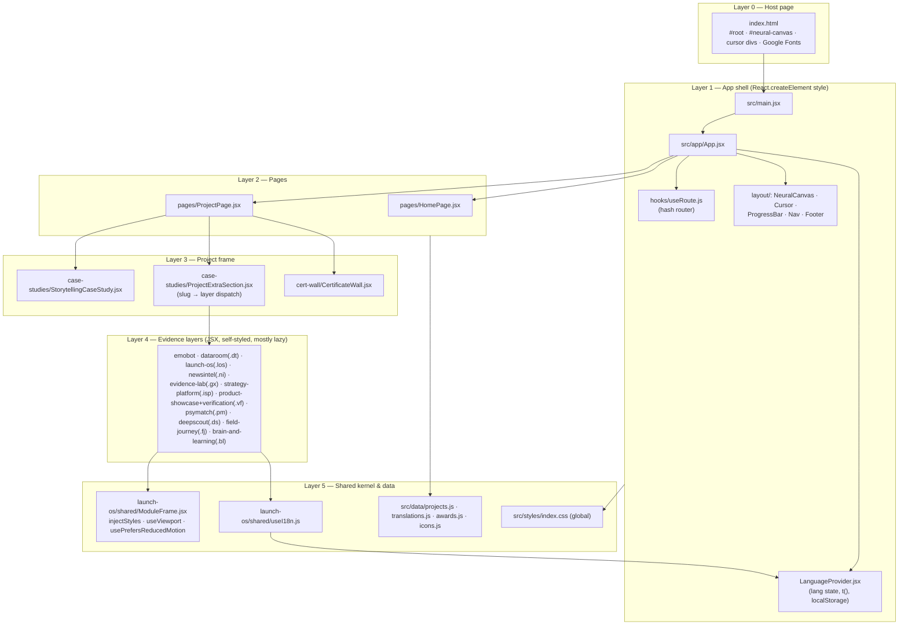
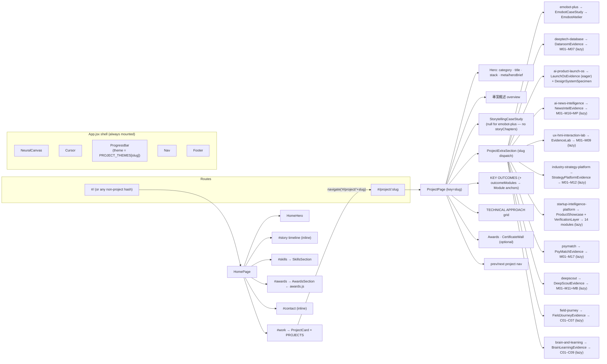
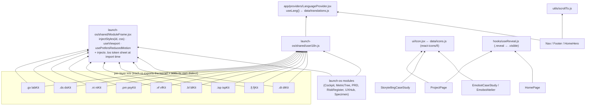
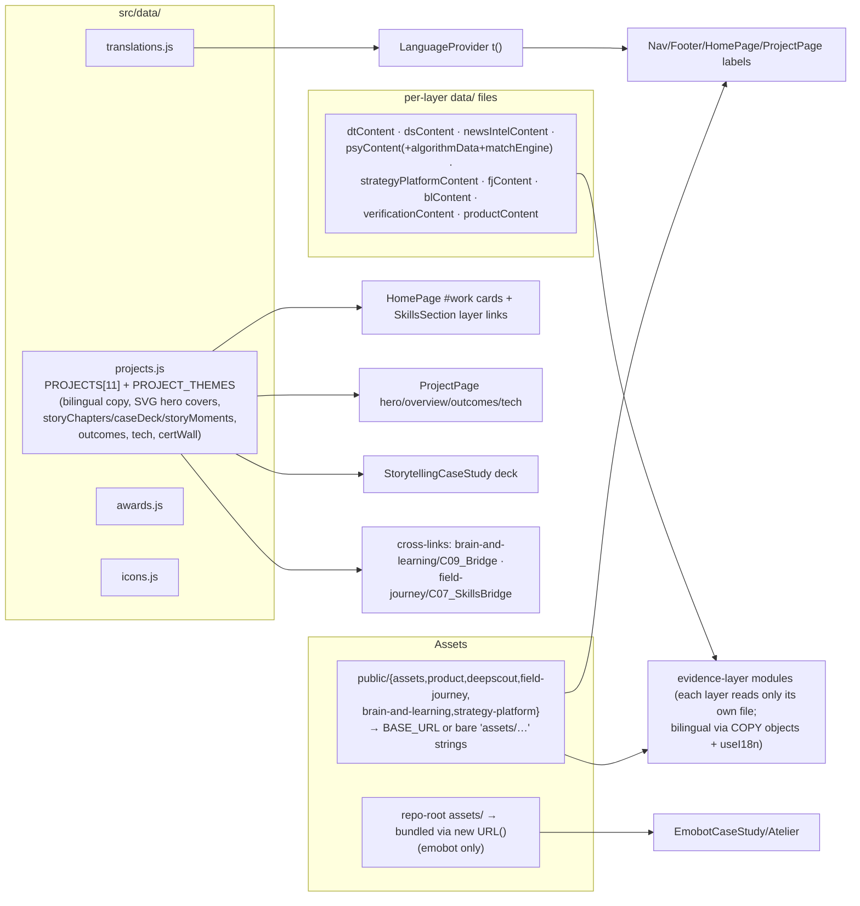
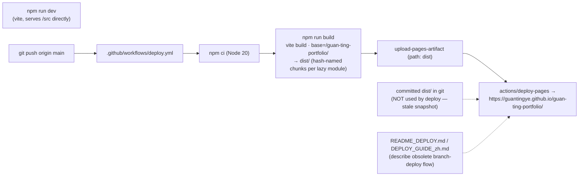

# ARCHITECTURE — Verified Structure & Diagrams

> Every edge below was confirmed by reading imports/JSX in the named files (2026-07-20). Legend: **[V]** verified · **[I]** interpretation · **[?]** uncertain.

## 1. Layered frontend architecture

**[V]** The codebase has five clean layers. The one architectural oddity: the shared "framework" for all evidence layers lives inside one project's folder (`launch-os/shared/`), not in a neutral location.

## 2. Route → page → section → component

**[V]** Only two route shapes exist (`useRoute.js:10-15`); everything else is section-level anchors.

## 3. Shared component dependencies

**[V]** The critical fan-in: every evidence kit imports `launch-os/shared/*` and re-exports it (e.g. `labKit.jsx:2-5`), so each layer's modules import only their own kit. `useI18n` chains into the app-level `LanguageProvider`, which is how language toggling reaches every module without prop drilling.

**[V]** Side-effect to know: importing *any* kit transitively imports `ModuleFrame.jsx`, which immediately injects the `.los` token stylesheet (`ModuleFrame.jsx:56`). Because most layers are behind `React.lazy`, that only happens once a project page mounts a layer.

## 4. Content / data flow

**[V]** Two i18n systems coexist by design: shell copy goes through `translations.js` key lookup (`t('projOverview')`), while project copy uses **field twins** (`title`/`zhTitle`, resolved in `ProjectPage.jsx:38` and `StorytellingCaseStudy`), and evidence modules use per-module `COPY = {en:{…}, zh:{…}}` read through `useI18n`.

## 5. Build & deployment flow

**[V]** Code-splitting falls out of the `React.lazy(() => import(...))` pattern inside each evidence entry — `dist/assets/` contains one chunk per module (e.g. `C01_Question-*.js`, `B1PipelineArchitecture-*.js`), so a visitor downloads a layer's modules only on that project page.

## Uncertainties **[?]**

- Whether GitHub Pages settings are actually set to "GitHub Actions" source can't be verified from the repo; the workflow implies it, and the committed `dist/` implies an *earlier* branch-deploy era.
- `MotionSection`'s exact animation behavior (in-view fade vs. layout) was not read line-by-line; verified only that it wraps home sections and imports `motion/react`.
- Runtime icon CDNs in `SkillsSection` (`cdn.jsdelivr.net`, `cdn.simpleicons.org`, `SkillsSection.jsx:6-7`) — verified the URLs exist in code; not verified which are actually rendered on the current design.
